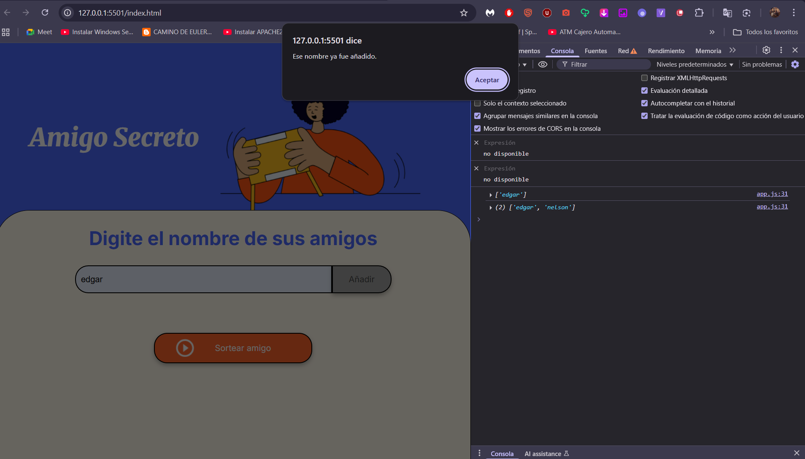

# 🎉 Proyecto: Amigo Secreto

## 📌 Descripción
Este es un proyecto web sencillo que permite gestionar una lista de amigos y realizar un sorteo aleatorio para determinar quién es el **"amigo secreto"**.  

El flujo de uso es simple:
1. Agregar nombres a una lista mediante un campo de texto.
2. Visualizar los nombres agregados.
3. Realizar un sorteo aleatorio para elegir un amigo secreto.
4. Reiniciar la lista en cualquier momento.

### Archivos principales
- **[index.html](index.html):** estructura base del proyecto.  
- **[style.css](style.css):** estilos visuales de la interfaz.  
- **[app.js](app.js):** lógica del juego.  
- **[.vscode/settings.json](.vscode/settings.json):** configuración para usar Live Server.  

---

## 🛠️ Proceso de desarrollo

### 1. Estructura inicial
- Se creó la maqueta en **index.html** con:
  - Un input para escribir nombres.
  - Botones para agregar, sortear y reiniciar.
  - Una lista visible para mostrar los amigos.
- Se enlazaron los estilos con **style.css** y la lógica con **app.js**.

---

### 2. Funcionalidad: Agregar nombres
- Implementación de la función `agregarAmigo()`:
  - Lee el valor del campo de texto.
  - Valida que no esté vacío ni duplicado.
  - Añade el nombre al arreglo `amigos`.
  - Actualiza la lista en pantalla con `actualizarLista()`.

📷 **Ejemplo de estado inicial tras agregar nombres:**  

---

### 3. Funcionalidad: Sorteo
- Implementación de la función `sortearAmigo()`:
  - Selecciona un nombre aleatorio de la lista `amigos`.
  - Muestra el resultado en el área de resultados.
  - Evita el sorteo si la lista está vacía.

---

### 4. Funcionalidad extra: Reiniciar lista
- Se añadió el botón **"Reiniciar lista"**.
- Implementación de `resetearLista()`:
  - Vacía el arreglo `amigos`.
  - Limpia la lista visual y el resultado.

📷 **Estado final de la aplicación:**  

---

## ▶️ Cómo ejecutar

1. Clonar o descargar este repositorio.  
2. Abrir el archivo **index.html** en el navegador.  
   - Alternativamente, ejecutar con **Live Server** en VS Code para recargar automáticamente.  

### Flujo de uso
1. Escribir un nombre en el input y pulsar **"Añadir"** → `agregarAmigo()`.  
2. Pulsar **"Sortear amigo"** → `sortearAmigo()`.  
3. Pulsar **"Reiniciar lista"** → `resetearLista()`.  

---

## 🔗 Demo en línea
👉 [Ver proyecto en vivo](https://edgarg1013.github.io/Amigo-secreto/)  

---

## 📂 Referencias a código
- **app.js**
  - Variable: `amigos`  
  - Funciones:  
    - `agregarAmigo()`  
    - `actualizarLista()`  
    - `sortearAmigo()`  
    - `resetearLista()`  
- **index.html:** estructura principal.  
- **style.css:** estilos visuales.  

---

## 🚀 Mejoras futuras
- Guardar la lista en **localStorage** para mantenerla entre recargas.  
- Mejorar validaciones (ej. nombres con mayúsculas/minúsculas).  
- Agregar animaciones al sorteo.  
- Posibilidad de realizar múltiples sorteos en secuencia.  
